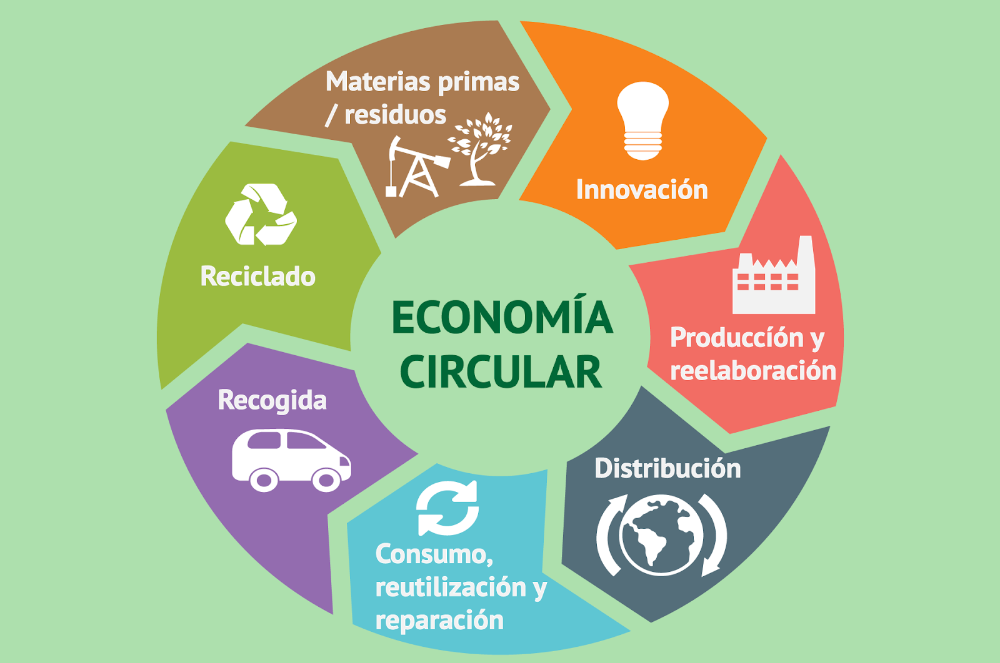

# Economia Circular

## Indice
1. [Introduccion](introduccion.md)
2. [Concepto de economia circular](concepto.md)
3. [Modelos de producción actuales y consumismo](modelos.md)
4. [La economía verde](economia_verde.md)
5. [Ciclo de vida de un producto](ciclo.md)
6. [El ecodiseño y las estrategias sostenibles](ecodiseño.md)
7. [Referencias](referencias.md)
8. [Conclusion](conclusion.md)
9. [Glosario](glosario.md)
10. [Mapa conceptual](mapa.md)

Alejandro Benítez Quidato
