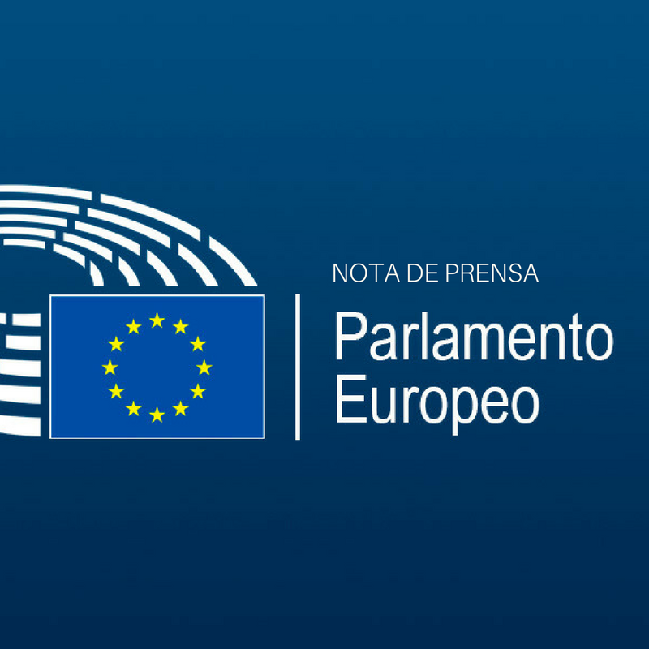
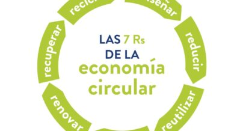

# Concepto Economía Circular 

# ¿Qué es la economía circular?

Según la definición que establece la Unión Europea, la economía circular es un modelo de producción y consumo que implica compartir, alquilar, reutilizar, reparar, renovar y reciclar materiales y productos existentes todas las veces que sea posible para crear un valor añadido. De esta forma, el ciclo de vida de los productos se extiende.

--------------------------------------------------------

--------------------------------------------------------

# La regla de las 7R.

1. Rediseñar: Diseñar o fabricar productos teniendo en cuenta las consecuencias medioambientales.
2. Reducir: Reducir tanto la cantidad de productos que consumimos como los que generamos como residuos.
3. Reutilizar: Darle un nuevo uso a los productos que ya han sido utilizados para su finalidad principal.
4. Reparar: Reparar productos antes que tirarlo.
5. Renovar: Actualizar los objetos para que puedan tener de nuevo la función para la que fueron creados.
6. Recuperar: Recuperar los materiales ya usados para poder reintroducirlos como materia prima
7. Reciclar: Desecharlos en el contenedor oportuno.

