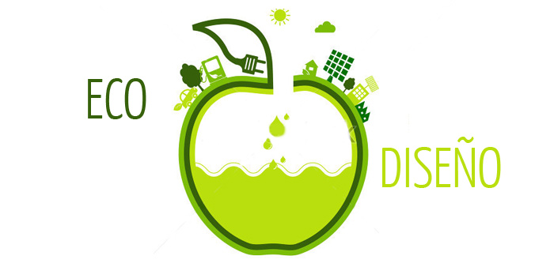
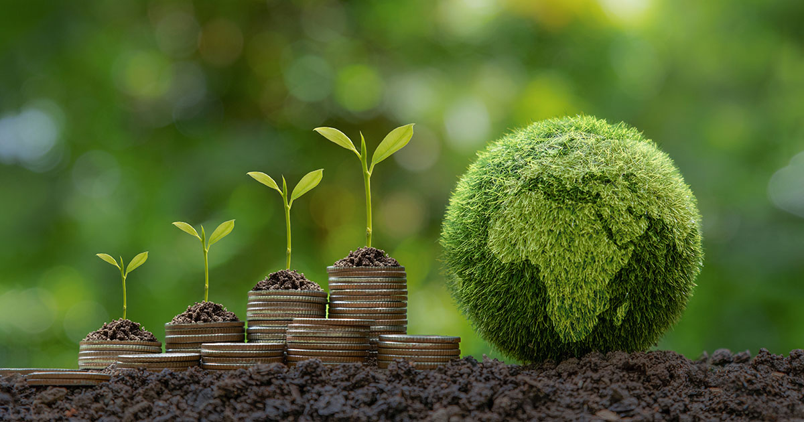

# Ecodiseño

El ecodiseño es una filosofía que persigue diseñar productos y servicios sostenibles, que minimicen el impacto ambiental durante todo el ciclo de vida del producto desde su el diseño propiamente dicho hasta la producción, utilización y retirada. Para ello, a los criterios convencionales de cualquier proceso de diseño (coste, utilidad, fabricabilidad, seguridad, etc.) se suman criterios de carácter ambiental.

El ecodiseño trata entonces de identificar los posibles aspectos e impactos ambientales de un producto/servicio basándose en el proceso de mejora continua, lo que permite tomar decisiones encaminadas a minimizar su repercusión en el medio ambiente.

Las mejoras ambientales detectadas implican en muchas ocasiones sencillos cambios que, realizados a tiempo, suponen importantes avances en materia ambiental y, con frecuencia, repercuten en reducciones de costes significativas.

 
 
# Economía Verde

Es un modelo económico que prioriza el éxito del bienestar humano y la equidad social, al tiempo que reduce los riesgos medioambientales y la escasez ecológica. Pero, ¿qué significa economía verde? Por definición, economía verde es la práctica del desarrollo sostenible a través del apoyo de la inversión pública y privada para crear infraestructuras que promuevan la sostenibilidad social y medioambiental. La importancia de la economía verde radica en que impulsa a las economías a ser más sostenibles y bajas en carbono, y garantiza que los bienes naturales sigan proporcionando los recursos y servicios medioambientales para nuestro continuo bienestar.

 
